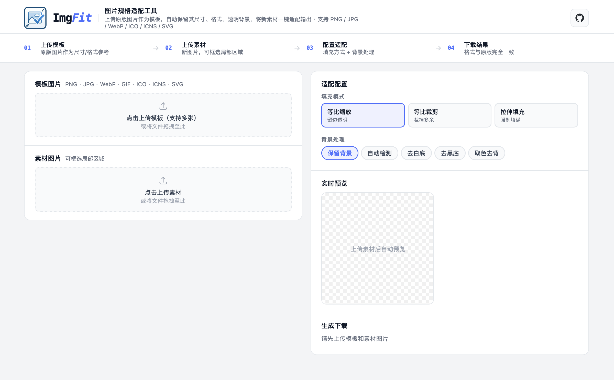

# [ImgFit](https://github.com/HatcherZhao/imgfit) — 图片规格适配工具

> 上传原版图片作为模板，自动保留其**尺寸、格式、透明背景**，将新素材一键适配输出。


---

## ✨ 为什么你需要它

你是否遇到过这些场景：

- 品牌换 Logo，需要把新 Logo 适配到几十个不同尺寸的图标文件（PNG / ICO / ICNS）
- 产品迭代，需要用新图替换旧图，但必须保持原文件的尺寸和格式
- 设计稿有透明背景，导出后背景消失了

**ImgFit 就是为此而生。** 它不改变模板的任何规格，只替换画面内容。



---

## 🚀 功能特性

| 功能 | 说明 |
|------|------|
| 📐 保留原版规格 | 输出文件与模板尺寸、格式、透明背景完全一致 |
| 🖼 多格式支持 | PNG · JPG · WebP · GIF · ICO · ICNS · SVG |
| 📦 批量模板 | 一次上传多张模板，逐个生成下载 |
| ✂️ 框选裁剪 | 拖拽选择素材的局部区域使用 |
| 🎨 智能去背景 | 自动检测 / 去白底 / 去黑底 / 点击取色去背 |
| 👁 实时预览 | 调整参数后即时预览效果，点击查看大图 |
| 🔒 隐私安全 | 所有处理在内存中完成，不保存任何文件到服务器 |

---

## 📸 使用流程

```
01 上传模板  →  02 上传素材  →  03 配置适配  →  04 下载结果
```

1. **上传模板图片** — 原版图片作为尺寸/格式参考，支持多张
2. **上传素材图片** — 新图片，可拖拽框选局部区域
3. **配置适配方式** — 选择填充模式（等比缩放/裁剪/拉伸）和背景处理
4. **生成并下载** — 格式与原版完全一致

---

## 🛠 本地运行

### 方式一：Docker Compose（推荐）

```bash
git clone https://github.com/HatcherZhao/imgfit.git
cd imgfit
docker compose up --build
```

访问 http://localhost:3000

### 方式二：手动启动

**后端（Python 3.10+）**

```bash
cd backend
pip install -r requirements.txt
uvicorn app.main:app --reload --port 8000
```

**前端（Node.js 18+）**

```bash
cd frontend
npm install
npm run dev
```

访问 http://localhost:5173

---

## 🏗 技术栈

- **前端**: React + Vite，纯 inline styles，无 UI 框架依赖
- **后端**: Python FastAPI + Pillow
- **部署**: Docker Compose + Nginx 反向代理
- **去背景算法**: BFS Flood Fill（边缘连通 + 封闭区域二次扫描）

---

## 📄 License

MIT
